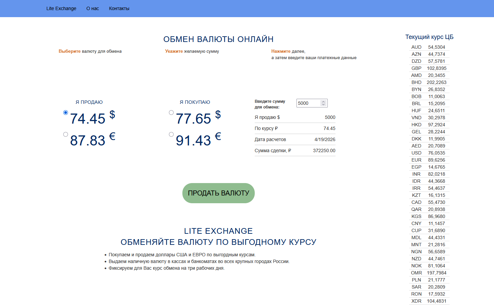

# Currency Exchange — Online Order Form


A training ASP.NET MVC web application simulating an online currency exchange service.

 The app fetches live exchange rates from the Central Bank of Russia (CBR), applies a bank margin, and lets a user submit a currency exchange order through a multi-step form.

---

## Features

- **Live exchange rates** — parses the official CBR XML feed (`cbr.ru`) on every page load
- **Bank margin calculation** — displays buy/sell prices for USD and EUR with configurable spread
- **Multi-step order flow:**
  - Step 1 — select currency (USD/EUR) and operation (buy/sell), enter amount
  - Step 2 — review order details, fill in contact information (name, phone, email)
  - Step 3 — confirmation page
- **Order persistence** — saves each submitted order to a SQL Server database via Entity Framework

---

## Tech Stack

| Layer | Technology |
|---|---|
| Framework | ASP.NET MVC 5 (.NET Framework) |
| ORM | Entity Framework 6 (Code First) |
| Database | SQL Server LocalDB |
| External API | CBR XML daily rates feed |
| Frontend | Razor Views, Bootstrap 3, jQuery |
| Package manager | NuGet |

---

## Project Structure

```
Controllers/
  HomeController.cs     — main controller: loads rates, handles order steps
Models/
  LoadCursCB.cs         — fetches and parses CBR XML, calculates buy/sell rates
  ExchangeOptions.cs    — order model (operation, currency, amount, contact info)
  OrderContext.cs       — EF DbContext
Views/Home/
  Index.cshtml          — currency selector + amount input
  Step2.cshtml          — order summary + contact form
  Step3.cshtml          — confirmation page
```

---

## How It Works

1. On page load, `LoadCursCB.LoadCurs()` fetches the CBR XML feed and extracts USD/EUR rates.
2. Bank buy/sell prices are derived by adding/subtracting a fixed margin (`deltaUSD`, `deltaEUR`).
3. The user selects a currency and direction, enters an amount — JavaScript calculates the total on the fly.
4. On Step 2, the user confirms the deal and submits personal details via a POST form.
5. The controller saves the `ExchangeOptions` entity to the database and redirects to the confirmation page.

---

## Getting Started

**Prerequisites:** Visual Studio 2017+, SQL Server LocalDB

1. Clone the repository
2. Open `CurrencyExchange/CurrencyExchange.sln` in Visual Studio
3. Build the solution — NuGet will restore packages automatically
4. Run the project (`F5`) — EF will create the database on first launch
5. The app opens in the browser at `http://localhost:{port}/`

---

## What I Practiced

- MVC architecture and request lifecycle in ASP.NET MVC 5
- Consuming an external XML API and parsing it with `XmlDocument`
- Entity Framework Code First — model → migration → database
- Razor syntax and passing data with `ViewBag`
- Bootstrap layout and form validation
- Multi-step form flow with GET/POST actions and redirect-after-POST pattern
